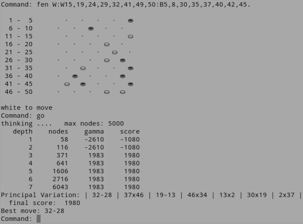

# github_test
Test: Add existing project to Github 

IMAGE
=====

Run it!
=======
MAD100.nim is contained in five Nim files:  
- mad100_run.nim
- mad100.nim
- mad100_moves.nim 
- mad100_search.nim 
- mad100_play.nim  

I compiled the code with Nim Compiler Version 0.13.0 (2016-05-19) [Linux: i386]

[Nim website: ](http://nim-lang.org/)
